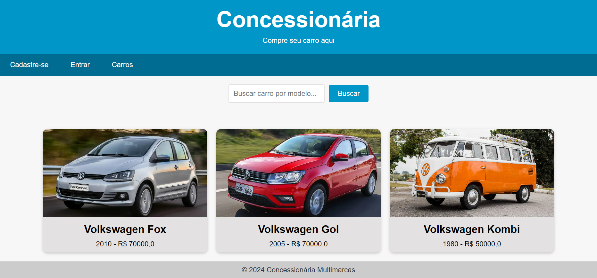
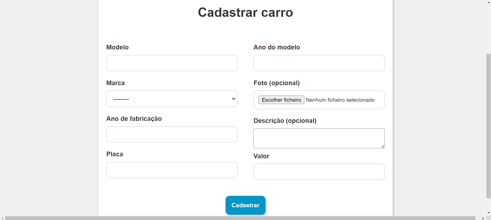

# Projeto Carros
Projeto de gestão de carros desenvolvido com o framework Django Python. Capaz de criar, deletar, editar e listar todos os veículos, o sistema também pode utilizar a IA Gemini para gerar as descrições não preenchidas dos carros.

---

<<<<<<< HEAD
## Imagens do projeto 

> ### Listagem dos Carros Cadastrados

> ### Cadastro de Novos Carros

=======
> ### Listagem dos Carros Cadastrados

>>>>>>> a16a9f0fb35efa8562308e0965c805b860c27ae1
