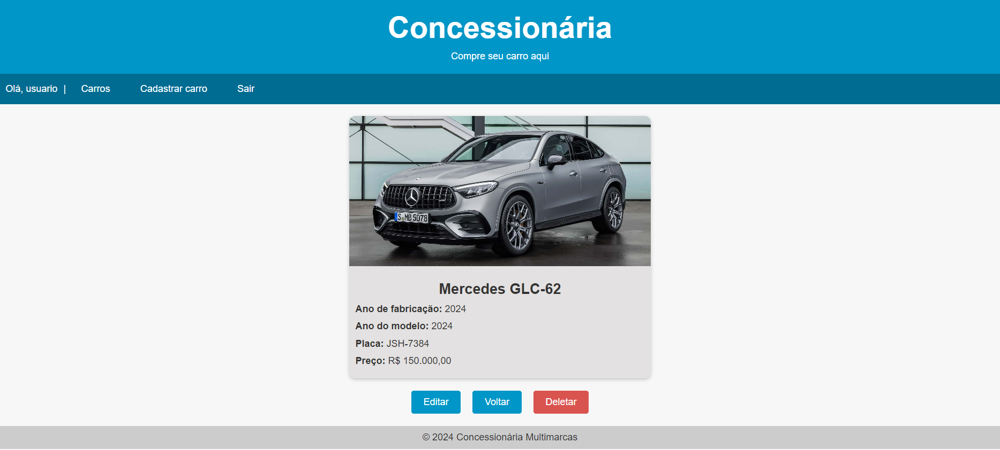

# Projeto Carros
Projeto de gestão de carros desenvolvido com o framework Django Python. Capaz de criar, deletar, editar e listar todos os veículos, o sistema também pode utilizar a IA Gemini para gerar as descrições não preenchidas dos carros.

---

## Imagens do projeto 

> ### Listagem dos Carros Cadastrados

> ### Cadastro de Novos Carros

> ### Detalhes do Carro

